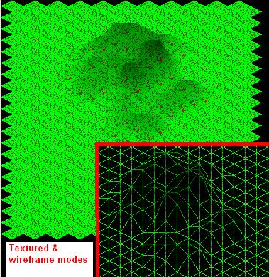



## DirectX Isometric Tile Engine Map editor

### Description

This is an incomplete (but functional) DirectX Isometric Tile Engine. I've lost all interest in finishing this, so I took it out of my archives, and I'm sharing it with all of you.

Some complete features : scaling (zoom), light vertices, changing map heights.

Some incomplete feature : moving, rotating, saving. Some unimplemented features that could be very cool : adding meshes, adding lighting, etc...

If you ever do something cool out of this, please tell me. If you wish to work on it, feel free to email me if you've got questions.

NOTE : I use the CCRP Slider OCX in this project, be sure to have it so you can check out this project
 
### More Info
 

             |
---                |---
**Submitted On**   |2002-11-02 01:52:52
**By**             |[Julien Lecomte](https://github.com/Planet-Source-Code/PSCIndex/blob/master/ByAuthor/julien-lecomte.md)
**Level**          |Advanced
**User Rating**    |4.7 (14 globes from 3 users)
**Compatibility**  |VB 5\.0, VB 6\.0
**Category**       |[Games](https://github.com/Planet-Source-Code/PSCIndex/blob/master/ByCategory/games__1-38.md)
**World**          |[Visual Basic](https://github.com/Planet-Source-Code/PSCIndex/blob/master/ByWorld/visual-basic.md)
**Archive File**   |[DirectX\_Is1491531132002\.zip](https://github.com/Planet-Source-Code/julien-lecomte-directx-isometric-tile-engine-map-editor__1-40325/archive/master.zip)

